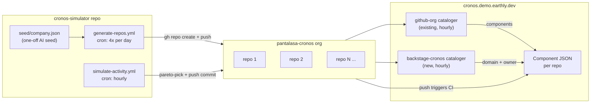

# Cronos 1000+ Repo Load Test — Implementation Plan

## Overview

Build a GitHub Actions–driven simulator that ramps ~150 AI-authored repos/day into `pantalasa-cronos` (reaching 1000+ in a week), uses prior-repos context to keep new repos realistic, writes `lunar.yml` + `catalog-info.yaml` per repo for a custom backstage cataloger to fill domain/owner, and runs a Pareto-weighted commit cron. All workflows have repo-var on/off kill switches and manual dispatch for +150 on-demand batches.

## Goals

- Reach **1000+ real repos** in `pantalasa-cronos` org over ~7 days (Pareto-distributed activity thereafter).
- Every repo is AI-authored with a realistic archetype (language, role, lifecycle), so code collectors exercise the full pipeline.
- Cataloging is **fully automatic** (no per-repo edits to `pantalasa-cronos/lunar/lunar-config.yml`): the `github-org` cataloger discovers repos; a new **custom backstage cataloger** reads `catalog-info.yaml` from each repo and fills `domain` + `owner`.
- Everything runs in a **new `pantalasa-cronos/cronos-simulator` GitHub Actions repo** with daily/hourly crons.

## Architecture



## Component breakdown

### 1. New repo: `pantalasa-cronos/cronos-simulator`

Contains everything. Uses a dedicated PAT from repo secrets.

```
cronos-simulator/
├── .github/workflows/
│   ├── seed-company.yml         # manual: generate company.json via AI
│   ├── generate-repos.yml       # cron 4x/day: create ~38 repos (~150/day total)
│   └── simulate-activity.yml    # cron hourly: push commits per Pareto weights
├── seed/
│   ├── company.json             # AI-generated: domains, teams, owners, archetypes
│   └── archetypes.yml           # weighted list (language × role × lifecycle)
├── scripts/
│   ├── gen-company.sh           # one-off: prompts Claude, writes seed/company.json
│   ├── gen-repo.py              # creates ONE repo (AI-authored code + lunar.yml + catalog-info.yaml)
│   ├── simulate-activity.py     # picks repos by weight, pushes 1-N commits
│   └── pareto.py                # shared weighting helper
└── state/
    └── repos.jsonl              # ledger: name, archetype, tier, created_at, last_commit_at
```

### 2. AI generation strategy (script-with-AI-seed, context-aware)

- **Once at setup** (`seed-company.yml`, manual): `gen-company.sh` prompts Claude (Opus) once to produce `seed/company.json`:
  - ~10 top-level domains (platform, product, data, security, infra, payments, growth, ml, mobile, tooling)
  - **2-4 subdomains each (~20-40 total)** with team names + owner emails (fictional `@pantalasa.org`)
  - ~30 repo archetypes with weights (see below)
  - This file is committed. Regenerate only if we want a new persona.
- **Per-repo** (`gen-repo.py`, called from cron or manually): given an archetype picked by weight, shell out to Claude Code CLI with a tightly-scoped prompt:
  - **Prior-repos context:** script passes a compact summary of the last N existing repos (e.g. last 30 names + domain + role, sampled from `state/repos.jsonl`) into the prompt, so Claude can pick a name/description that is plausibly the "next" thing this company would build, avoid duplicating existing ones, and reuse naming conventions it sees in the list.
  - Input: archetype (e.g. `{language: go, role: api-service, lifecycle: production}`), assigned domain, owner, target repo name (or Claude may override the name based on prior-repos context).
  - Output (written by Claude directly into an empty working dir): minimal but real code (~5-15 files), `README.md`, `Dockerfile` if production, `.github/workflows/ci.yml`, `CODEOWNERS`, `lunar.yml`, `catalog-info.yaml`.
  - Script then `gh repo create pantalasa-cronos/<name> --private`, pushes, records in `state/repos.jsonl`.

### 3. Archetype weights (realistic distribution)

Stored in `seed/archetypes.yml` — easy to tune. Example weights (out of 100):

- **Languages** — go:18, python:18, node:20, java:10, rust:4, ruby:5, php:3, cpp:2, shell:5, yaml-only (k8s/helm/tf):10, docs-only:5
- **Roles** — api-service:30, library:25, cli-tool:8, worker/consumer:10, frontend-app:12, data-pipeline:5, infra-as-code:5, docs:3, sandbox/experiment:2
- **Lifecycle** — production:45, maintenance:30, experimental:15, archived:10 (real archived repos via `gh repo archive`)

Script samples from each dimension independently, then generates a name like `<team-prefix>-<noun>-<suffix>` (e.g. `payments-ledger-api`, `growth-metrics-worker`).

### 4. Catalog population — two catalogers working together

**A. Existing `github-org` cataloger** (already in `lunar-lib/catalogers/github-org`)

- Enable it in `pantalasa-cronos/lunar/lunar-config.yml` (currently commented out ~line 131):

```yaml
catalogers:
  - name: github-org
    uses: github://earthly/lunar-lib/catalogers/github-org@v1.1.0
    hook:
      type: cron
      schedule: "0 * * * *"
    with:
      org_name: "pantalasa-cronos"
      default_owner: "engineering@pantalasa.org"
```

- This gives us every repo as a component + basic tags from GitHub topics.

**B. New custom cataloger: `pantalasa-cronos/lunar/catalogers/backstage-cronos/`** (kept local for now; promote to lunar-lib later).

- Enumerates repos via `gh repo list pantalasa-cronos` (same pattern as github-org cataloger).
- For each repo: `gh api repos/<repo>/contents/catalog-info.yaml` → parse `spec.owner` (email) and a custom `pantalasa.org/domain` annotation → `lunar catalog raw --json '.components' -` with just `{owner, domain}` patches (merges with what github-org cataloger wrote).
- Batched at 1000 per `lunar catalog raw` call (pattern from `lunar-lib/catalogers/github-org/main.sh`).
- Hook: `cron` hourly. Added to `lunar-config.yml` as `./catalogers/backstage-cronos`.

### 5. Per-repo metadata files (what the AI generator writes)

**`lunar.yml`** — optional, Lunar reads it natively. Used as a fallback if catalogers miss something:

```yaml
components:
  github.com/pantalasa-cronos/<repo>:
    tags: [<lang>, <role>, <lifecycle>]
```

**`catalog-info.yaml`** — Backstage-style, consumed by both the existing backstage *collector* (writes `.backstage` in Component JSON) and the new backstage-cronos *cataloger* (populates domain/owner):

```yaml
apiVersion: backstage.io/v1alpha1
kind: Component
metadata:
  name: <repo>
  annotations:
    pantalasa.org/domain: platform.api-gateway   # cataloger reads this
spec:
  type: service
  lifecycle: production
  owner: jane@pantalasa.org                       # cataloger reads this
```

### 6. Ramp cron (repo creation) — easily tunable and switchable

`.github/workflows/generate-repos.yml`:

```yaml
on:
  schedule:
    # 4x/day when enabled. Disable by setting the ENABLED var to 'false'.
    - cron: "0 */6 * * *"
  workflow_dispatch:
    inputs:
      count:
        description: "How many repos to generate in this run"
        default: "38"
      force:
        description: "Run even if ENABLED=false"
        type: boolean
        default: false

jobs:
  generate:
    if: vars.ENABLED == 'true' || inputs.force == true
    runs-on: ubuntu-latest
    timeout-minutes: 60
    steps:
      - run: python scripts/gen-repo.py --count "${{ inputs.count || vars.REPOS_PER_RUN || 38 }}"
```

**Cadence / on-off controls** (all via GitHub Actions repo config — no code changes needed):

- **Off switch:** set repo variable `ENABLED=false` (Settings → Variables). Scheduled runs no-op; `workflow_dispatch` with `force=true` still works for a one-off.
- **Change cadence:** edit the single `cron:` line. Preset options:
  - `0 */6 * * *` — 4x/day (default)
  - `0 */3 * * *` — 8x/day (accelerate)
  - `0 */12 * * *` — 2x/day (slow down)
  - `0 2 * * *` — 1x/day (maintenance mode after 1000)
- **Change batch size:** set repo variable `REPOS_PER_RUN=N`, or override per manual dispatch via the `count` input.
- **Manually run +150 on demand:** Actions tab → "Generate repos" → Run workflow → set `count=150` → Run. Useful after the 1000 target is hit to add another batch.
- **Self-stop:** `gen-repo.py` reads `state/repos.jsonl` first and exits cleanly if count ≥ `TARGET_REPOS` var (default 1000) unless `--force` is passed.
- Sleeps 30-60s between repos so GitHub API + Anthropic API stay well under rate limits.
- Uses `ANTHROPIC_API_KEY_CRONOS_SIMULATOR` (new dedicated secret, not shared with bender/other workloads) so we can monitor spend and rotate independently.

### 7. Activity cron (commit simulation, Pareto) — same on-off + cadence controls

`.github/workflows/simulate-activity.yml`:

```yaml
on:
  schedule: [{cron: "0 * * * *"}]   # hourly
  workflow_dispatch:
    inputs:
      commits:
        description: "How many commits this run"
        default: "50"
      force:
        description: "Run even if ACTIVITY_ENABLED=false"
        type: boolean
        default: false

jobs:
  activity:
    if: vars.ACTIVITY_ENABLED == 'true' || inputs.force == true
    runs-on: ubuntu-latest
    steps:
      - run: python scripts/simulate-activity.py --commits "${{ inputs.commits || vars.COMMITS_PER_RUN || 50 }}"
```

- **Kill switch:** `ACTIVITY_ENABLED=false` instantly pauses all simulated commits (scheduled runs become no-ops). Critical if hub or runner capacity is overwhelmed.
- Each repo gets an `activity_tier` at creation time, sampled once:
  - `hot` (5%) — eligible every hour
  - `active` (25%) — eligible every 6h
  - `maintenance` (40%) — eligible every 3 days
  - `dormant` (30%) — never
- Per run: sample up to `COMMITS_PER_RUN` eligible repos weighted by tier (heavy on hot, light on others). Pareto emerges naturally.
- Commit action is intentionally minimal: append a line to `CHANGELOG.md` from a canned message pool, `git commit -m "chore: <msg>"`, `git push`.
  - No AI call per commit (too expensive and not needed for load-testing signal).
- Push triggers the repo's existing CI + Lunar code collectors naturally.

### 8. Domain/owner realism

Seed script produces (example) `seed/company.json`:

```json
{
  "domains": {
    "platform": {"owner": "platform-lead@pantalasa.org", "children": ["api-gateway", "identity", "observability"]},
    "payments": {"owner": "payments-lead@pantalasa.org", "children": ["ledger", "checkout", "fraud"]}
  },
  "people": [
    {"email": "jane.smith@pantalasa.org", "domains": ["platform.api-gateway"]}
  ]
}
```

The generator picks a domain, then picks an owner from people assigned to that domain.

## Open questions / prerequisites

1. **Hub capacity for this activity volume** — cronos hub has since moved (post k8s migration). Before flipping catalogers on and ramping past ~200 repos, verify: is there sufficient disk, DB, and CPU headroom to hold 1000+ components + their collection records + hourly cataloger runs + Pareto-driven code-collector execution? First 200 repos are the canary — watch hub metrics, then decide whether to keep ramping.
2. **CI runner capacity** — 1000 repos with hourly simulated commits will saturate the `cronos` self-hosted runner pool. Two tracks to address, not mutually exclusive:
   - **Short-term mitigation in the simulator:** simulator commits are marked (e.g. `[skip ci]` in the commit message, or push to a path that workflow `paths-ignore` excludes) so only "real" content changes exercise CI — lunar code-collectors still run on every push.
   - **Longer-term (out of scope for this plan, but called out):** significantly increase runner capacity or switch to ephemeral on-demand runners.
3. **GitHub PAT** — user to generate a new classic PAT with `repo` + `admin:org` scopes (for creating private repos in `pantalasa-cronos`) and store as `GH_PAT_CRONOS_SIMULATOR` secret on the `cronos-simulator` repo. (GitHub App route was considered but a dedicated PAT is simpler for this load-test tooling.)
4. **Dedicated Anthropic API key** — new `ANTHROPIC_API_KEY_CRONOS_SIMULATOR` secret, separate from bender's key, so spend on repo generation is isolated and easy to cap/rotate.
5. **Churn (post-1000)** — not required. After reaching 1000, repo generation goes dormant; `ENABLED=false` or switch cron to `0 2 * * *` (1x/day) if we want slow growth. User can `workflow_dispatch` another batch of 150 any time.

## Files that will change / be created

- **New repo:** `pantalasa-cronos/cronos-simulator` (all content listed in §1)
- **Edit:** `pantalasa-cronos/lunar/lunar-config.yml` — uncomment github-org cataloger block (~line 131); add new `backstage-cronos` cataloger entry under `catalogers:`
- **New:** `pantalasa-cronos/lunar/catalogers/backstage-cronos/{lunar-cataloger.yml, main.sh, install.sh}`
- **Unchanged:** existing components in `lunar-config.yml` stay hardcoded (catalogers merge into them non-destructively per Lunar semantics)

## Execution order

Tight 1-3 day sequence — no artificial phase gates:

1. Bootstrap `cronos-simulator` repo; wire secrets (`GH_PAT_CRONOS_SIMULATOR`, `ANTHROPIC_API_KEY_CRONOS_SIMULATOR`) and vars (`ENABLED`, `ACTIVITY_ENABLED`, `REPOS_PER_RUN`, `COMMITS_PER_RUN`, `TARGET_REPOS`).
2. Write `gen-company.sh` + seed prompt; run `seed-company.yml` manually once to commit `seed/company.json` (10 top-level domains × 2-4 subdomains).
3. Build `backstage-cronos` cataloger in `pantalasa-cronos/lunar/catalogers/backstage-cronos/` and wire into `lunar-config.yml` alongside enabling `github-org` cataloger. Push and confirm `sync-manifest` workflow passes.
4. Implement `gen-repo.py` end-to-end with one archetype + prior-repos context; run manually to create 1 test repo; confirm both catalogers pick it up and code collectors run (SQL check via Grafana API, per workspace docs).
5. Fill out all archetypes in `seed/archetypes.yml`; implement `simulate-activity.py` + canned message pool.
6. Enable both workflows (`ENABLED=true`, `ACTIVITY_ENABLED=true`); ramp begins. First ~200 repos act as canary for hub capacity — pause via `ENABLED=false` if metrics look bad and escalate.
