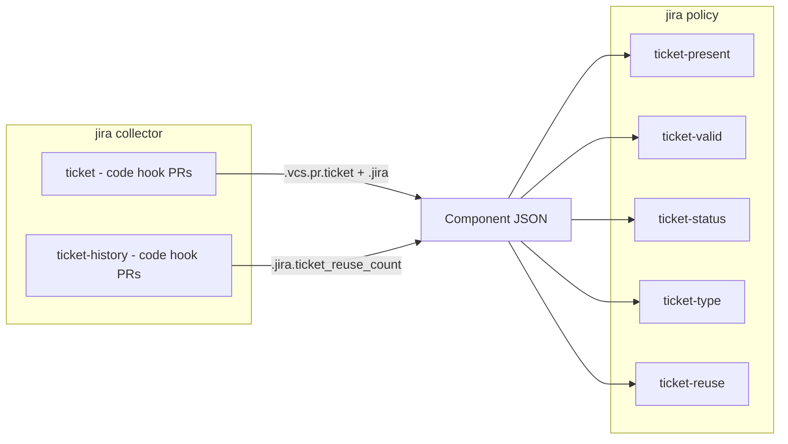

# Jira Plugin Implementation Plan

## Current State

Both `pantalasa` and `pantalasa-cronos` have local Jira prototypes:

- **Collector** (`collectors/jira/`): Extracts ticket ID from PR title (e.g. `[ABC-123] Fix bug`), fetches issue from Jira REST API, writes full response to `.jira.ticket`. Requires `GH_TOKEN` (to read PR title) and `JIRA_TOKEN` (to call Jira API). Hardcodes `JIRA_TICKET_PREFIX="["`, `JIRA_TICKET_SUFFIX="]"`, base URL, and user email.
- **Policy** (`policies/jira/`): Single check `jira-ticket-present` that asserts `.jira.ticket` exists on PRs.

**What needs to change for lunar-lib:**
1. Make collector configurable (inputs/secrets for base URL, user, ticket format)
2. Write to normalized `.vcs.pr.ticket` path (per Component JSON conventions) in addition to `.jira` native data
3. Add ticket-reuse detection sub-collector (queries Lunar SQL for historical PR data)
4. Add more policy checks (valid ticket, status, type, reuse limit)

---

## Architecture



---

## Collector: `jira`

Directory: `lunar-lib/collectors/jira/`

### Sub-collector 1: `ticket` (code hook, PRs only)

Extracts a Jira ticket reference from the PR title, validates it against the Jira API, and writes both normalized and native data.

- **Hook:** `code`, `runs_on: [prs]`
- **Strategy:** Strategy 10 (External Vendor API Integration) + Strategy 11 (VCS Provider API Queries)
- **Writes:**
  - `.vcs.pr.ticket.id` = ticket key (e.g. `"ABC-123"`)
  - `.vcs.pr.ticket.source` = `"jira"`
  - `.vcs.pr.ticket.url` = link to the Jira issue
  - `.vcs.pr.ticket.valid` = `true` (only written if Jira API returns successfully)
  - `.jira.ticket` = normalized ticket data (key, status, type, summary, assignee)
  - `.jira.native` = full raw Jira API response

**Improvements over pantalasa prototype:**
- Ticket prefix/suffix and pattern are configurable inputs (not hardcoded)
- Jira base URL and user come from inputs/secrets (not hardcoded)
- Writes to `.vcs.pr.ticket` for schema compliance
- Separates raw Jira response (`.jira.native`) from normalized fields (`.jira.ticket`)
- If ticket ID is extracted but Jira API fails, still writes `.vcs.pr.ticket.id` and `.vcs.pr.ticket.source` but omits `.vcs.pr.ticket.valid`, so the `ticket-valid` policy can distinguish "no ticket" from "invalid ticket"

### Sub-collector 2: `ticket-history` (code hook, PRs only)

Queries the Lunar SQL database to count how many other PRs reference the same Jira ticket. This follows the same pattern as the [semgrep default-branch collector](lunar-lib-wt-semgrep/collectors/semgrep/github-app-default-branch.sh) which queries `components_latest` via `lunar sql connection-string`.

- **Hook:** `code`, `runs_on: [prs]`
- **image:** `native` (needs psql access via `lunar sql connection-string`)
- **Strategy:** Strategy 3 (Cross-Component and Historical Data Queries)
- **Writes:**
  - `.jira.ticket_reuse_count` = number of distinct PRs (across all components) referencing the same ticket ID

**How it works:**
1. Extract ticket ID from PR title (same regex logic, shared via `helpers.sh`)
2. Get DB connection via `lunar sql connection-string`
3. Query `components_latest` for PRs with matching ticket ID:

```sql
SELECT COUNT(DISTINCT (component_id, pr))
FROM components_latest
WHERE pr IS NOT NULL
  AND component_json->'vcs'->'pr'->'ticket'->>'id' = '<ticket-id>'
  AND NOT (component_id = '<current-component>' AND pr = '<current-pr>')
```

4. Write the count to `.jira.ticket_reuse_count`

**Note:** This sub-collector depends on `.vcs.pr.ticket.id` being written by the `ticket` sub-collector (or any other collector that writes ticket data there). Since both sub-collectors extract the ticket ID from the PR title independently (shared helper), they don't have a runtime dependency.

### Files

| File | Purpose |
|------|---------|
| `lunar-collector.yml` | Manifest with both sub-collectors, inputs, secrets, landing page |
| `ticket.sh` | Extract ticket from PR title, fetch from Jira API |
| `ticket-history.sh` | Query Lunar SQL for ticket reuse count |
| `install.sh` | No-op (curl, jq, psql available in base images) |
| `helpers.sh` | Shared ticket extraction regex logic |
| `README.md` | Documentation |
| `assets/jira.svg` | Icon |

### `lunar-collector.yml` sketch

```yaml
version: 0

name: jira
description: Collect Jira ticket metadata from PR titles and validate against Jira API
author: support@earthly.dev

default_image: earthly/lunar-scripts:1.0.0

landing_page:
  display_name: "Jira Collector"
  long_description: |
    Extract Jira ticket references from pull request titles, validate them
    against the Jira REST API, and detect ticket reuse across PRs.
  categories: ["devex-build-and-ci"]
  icon: "assets/jira.svg"
  status: "stable"
  related:
    - slug: "jira"
      type: "policy"
      reason: "Enforces Jira ticket presence, validity, and reuse limits"

collectors:
  - name: ticket
    description: |
      Extracts Jira ticket ID from PR title, fetches issue metadata from
      the Jira REST API, and writes normalized ticket data to .vcs.pr.ticket
      and native Jira data to .jira.
    mainBash: ticket.sh
    hook:
      type: code
      runs_on: [prs]
    keywords: ["jira", "ticket", "pr", "issue tracking"]

  - name: ticket-history
    description: |
      Queries the Lunar SQL database to count how many other PRs reference
      the same Jira ticket. Writes .jira.ticket_reuse_count for policy
      evaluation. Detects ticket recycling abuse.
    mainBash: ticket-history.sh
    image: native
    hook:
      type: code
      runs_on: [prs]
    keywords: ["jira", "ticket reuse", "compliance", "audit"]

inputs:
  ticket_prefix:
    description: Character(s) before the ticket ID in PR titles
    default: "["
  ticket_suffix:
    description: Character(s) after the ticket ID in PR titles
    default: "]"
  ticket_pattern:
    description: Regex pattern for ticket ID (without prefix/suffix)
    default: "[A-Za-z][A-Za-z0-9]+-[0-9]+"
  jira_base_url:
    description: Jira instance base URL (e.g. https://acme.atlassian.net)
  jira_user:
    description: Jira user email for API authentication

secrets:
  JIRA_TOKEN:
    description: Jira API token for authentication
  GH_TOKEN:
    description: GitHub token for reading PR metadata

example_component_json: |
  {
    "vcs": {
      "pr": {
        "ticket": {
          "id": "ABC-123",
          "source": "jira",
          "url": "https://acme.atlassian.net/browse/ABC-123",
          "valid": true
        }
      }
    },
    "jira": {
      "ticket": {
        "key": "ABC-123",
        "status": "In Progress",
        "type": "Story",
        "summary": "Implement payment validation",
        "assignee": "jane@acme.com"
      },
      "ticket_reuse_count": 0,
      "native": { "...full Jira API response..." }
    }
  }
```

---

## Policy: `jira`

Directory: `lunar-lib/policies/jira/`

All checks skip on non-PR contexts (default branch evaluations).

### Check 1: `ticket-present`

Asserts that a Jira ticket is referenced in the PR.

- Checks `.vcs.pr.ticket` exists
- Skips if not in PR context (`LUNAR_COMPONENT_PR` is empty)

### Check 2: `ticket-valid`

Asserts that the referenced ticket actually exists in Jira.

- Checks `.vcs.pr.ticket.valid` is `true`
- If `.vcs.pr.ticket` exists but `.valid` is missing, the ticket ID was found in the PR title but the Jira API call failed (ticket doesn't exist or API error)
- Skips if no ticket referenced

### Check 3: `ticket-status`

Asserts the Jira ticket is in an acceptable status (e.g. not "Done" or "Closed").

- Input: `allowed_statuses` (comma-separated, default `""` = any status allowed)
- Input: `disallowed_statuses` (comma-separated, default `""` = none disallowed)
- Reads `.jira.ticket.status`
- Skips if no Jira data or if both inputs are empty

### Check 4: `ticket-type`

Asserts the Jira ticket is an acceptable issue type.

- Input: `allowed_types` (comma-separated, default `""` = any type allowed)
- Reads `.jira.ticket.type`
- Skips if no Jira data or if input is empty

### Check 5: `ticket-reuse`

Asserts the same ticket hasn't been used in too many PRs. This addresses the customer scenario where a single ticket is recycled across many PRs to circumvent ticketing requirements.

- Input: `max_ticket_reuse` (maximum number of other PRs allowed to use the same ticket, default `"3"`)
- Reads `.jira.ticket_reuse_count` (written by the `ticket-history` sub-collector)
- Fails with a message like: `"Ticket ABC-123 has been used in 7 other PRs (max allowed: 3). Create a new ticket for this work."`
- Skips if no reuse count data

### Files

| File | Purpose |
|------|---------|
| `lunar-policy.yml` | Manifest with all 5 checks, inputs, landing page |
| `ticket-present.py` | Ticket presence check |
| `ticket-valid.py` | Ticket validity check |
| `ticket-status.py` | Ticket status check |
| `ticket-type.py` | Ticket type check |
| `ticket-reuse.py` | Ticket reuse check |
| `helpers.py` | Shared PR-context skip logic |
| `requirements.txt` | `lunar_policy==0.2.2` |
| `README.md` | Documentation |
| `assets/jira.svg` | Icon |

### `lunar-policy.yml` sketch

```yaml
version: 0

name: jira
description: Enforce Jira ticket presence, validity, status, type, and reuse limits
author: support@earthly.dev

default_image: earthly/lunar-scripts:1.0.0

landing_page:
  display_name: "Jira Policy"
  long_description: |
    Enforce Jira ticket hygiene across your organization. Verify PRs reference
    valid Jira tickets, check ticket status and type, and detect ticket reuse
    across multiple PRs.
  categories: ["devex-build-and-ci"]
  icon: "assets/jira.svg"
  status: "stable"
  requires:
    - slug: "jira"
      type: "collector"
      reason: "Provides Jira ticket data for policy evaluation"

policies:
  - name: ticket-present
    description: Asserts that a Jira ticket is referenced in the PR title.
    mainPython: ./ticket-present.py
    keywords: ["jira", "ticket", "pr", "sdlc"]
  - name: ticket-valid
    description: Asserts the referenced Jira ticket exists and is valid.
    mainPython: ./ticket-valid.py
    keywords: ["jira", "ticket", "validation"]
  - name: ticket-status
    description: Asserts the Jira ticket is in an acceptable status.
    mainPython: ./ticket-status.py
    keywords: ["jira", "ticket", "status", "workflow"]
  - name: ticket-type
    description: Asserts the Jira ticket is an acceptable issue type.
    mainPython: ./ticket-type.py
    keywords: ["jira", "ticket", "type", "issue type"]
  - name: ticket-reuse
    description: |
      Detects when the same Jira ticket is reused across too many PRs.
      Prevents teams from recycling a single ticket to circumvent
      ticketing requirements.
    mainPython: ./ticket-reuse.py
    keywords: ["jira", "ticket reuse", "compliance", "audit"]

inputs:
  allowed_statuses:
    description: Comma-separated list of allowed Jira statuses (empty = any)
    default: ""
  disallowed_statuses:
    description: Comma-separated list of disallowed Jira statuses (empty = none)
    default: ""
  allowed_types:
    description: Comma-separated list of allowed issue types (empty = any)
    default: ""
  max_ticket_reuse:
    description: Maximum number of other PRs allowed to reference the same ticket
    default: "3"
```

---

## Component JSON Schema

| Path | Type | Written By | Description |
|------|------|-----------|-------------|
| `.vcs.pr.ticket.id` | string | ticket | Ticket key (e.g. `"ABC-123"`) |
| `.vcs.pr.ticket.source` | string | ticket | `"jira"` |
| `.vcs.pr.ticket.url` | string | ticket | Link to Jira issue |
| `.vcs.pr.ticket.valid` | boolean | ticket | `true` if Jira API confirmed ticket exists |
| `.jira.ticket.key` | string | ticket | Ticket key |
| `.jira.ticket.status` | string | ticket | Issue status (e.g. `"In Progress"`) |
| `.jira.ticket.type` | string | ticket | Issue type (e.g. `"Story"`, `"Bug"`) |
| `.jira.ticket.summary` | string | ticket | Issue summary/title |
| `.jira.ticket.assignee` | string | ticket | Assignee email |
| `.jira.native` | object | ticket | Full raw Jira API response |
| `.jira.ticket_reuse_count` | number | ticket-history | Count of other PRs using the same ticket |

---

## Ticket Reuse Detection -- Feasibility Notes

The ticket-reuse feature relies on Strategy 3 (Cross-Component Historical Data Queries) using the Lunar SQL database. This is proven to work -- the [semgrep default-branch collector](lunar-lib-wt-semgrep/collectors/semgrep/github-app-default-branch.sh) uses the exact same pattern:

1. `lunar sql connection-string` to get the DB connection
2. `psql` to query `components_latest` table
3. `jsonb_path_exists` or `->>'field'` to filter on Component JSON data

The query counts distinct `(component_id, pr)` pairs where `.vcs.pr.ticket.id` matches the current ticket. This works across all components, so reuse is detected organization-wide, not just within a single repo.

**Limitation:** The ticket-reuse count is only as accurate as the data in Lunar's database. If a component doesn't have the Jira collector enabled, its PRs won't be counted. This is acceptable -- the count represents a lower bound.

**Edge case:** The first PR to use a ticket will have `ticket_reuse_count: 0`. The second will see `1`. With `max_ticket_reuse: 3`, the 5th PR (count=4) would fail. This means 4 PRs can share one ticket, which is reasonable for feature work that spans multiple PRs.

---

## Implementation Steps

1. Create worktree `lunar-lib-wt-jira` on branch `brandon/jira`
2. Implement the `jira` collector (`ticket.sh` ported from pantalasa + new `ticket-history.sh`)
3. Implement the `jira` policy (all 5 checks)
4. Test using `lunar dev` commands against pantalasa-cronos components (see Testing section)
5. Complete the pre-push checklist (see LUNAR-PLUGIN-GUIDE.md)
6. Create draft PR

---

## Testing

### Local Dev Testing (relative paths)

Use relative paths in `pantalasa-cronos/lunar/lunar-config.yml` for fast iteration:

```yaml
collectors:
  - uses: ../lunar-lib-wt-jira/collectors/jira
    on: ["domain:engineering"]
    with:
      ticket_prefix: "["
      ticket_suffix: "]"
      jira_base_url: "https://earthly.atlassian.net"
      jira_user: "brandon@earthly.dev"

policies:
  - uses: ../lunar-lib-wt-jira/policies/jira
    name: jira
    initiative: sdlc-process
    enforcement: report-pr
    with:
      disallowed_statuses: "Done,Closed"
      max_ticket_reuse: "3"
```

Run dev commands from `pantalasa-cronos/lunar`:

```bash
# Collector
lunar collector dev jira.ticket --component github.com/pantalasa-cronos/backend
lunar collector dev jira.ticket-history --component github.com/pantalasa-cronos/backend

# Policy
lunar policy dev jira.ticket-present --component github.com/pantalasa-cronos/backend
lunar policy dev jira.ticket-valid --component github.com/pantalasa-cronos/backend
lunar policy dev jira.ticket-status --component github.com/pantalasa-cronos/backend
lunar policy dev jira.ticket-type --component github.com/pantalasa-cronos/backend
lunar policy dev jira.ticket-reuse --component github.com/pantalasa-cronos/backend
```

### Demo Environment Testing (branch references)

If you need to push to the demo hub, use branch references (requires pushing the branch first):

```yaml
collectors:
  - uses: github://earthly/lunar-lib/collectors/jira@brandon/jira
    on: ["domain:engineering"]
    with:
      ticket_prefix: "["
      ticket_suffix: "]"
      jira_base_url: "https://earthly.atlassian.net"
      jira_user: "brandon@earthly.dev"
```

### Expected Results (pantalasa-cronos)

**Important:** The Jira collector only runs on PRs (`runs_on: [prs]`). Default branch evaluations will not produce Jira data.

**On default branch (no PR context):**

| Component | Check | Expected |
|-----------|-------|----------|
| backend (Go) | ticket-present | SKIP (not a PR) |
| frontend (Node) | ticket-present | SKIP (not a PR) |
| auth (Python) | ticket-present | SKIP (not a PR) |
| all components | ticket-valid, ticket-status, ticket-type, ticket-reuse | SKIP (no data) |

**On a PR with `[ABC-123]` in the title (valid Jira ticket):**

| Check | Expected |
|-------|----------|
| ticket-present | PASS |
| ticket-valid | PASS (if ticket exists in Jira) |
| ticket-status | PASS (if status is not in disallowed list) |
| ticket-type | SKIP (if `allowed_types` is empty) |
| ticket-reuse | PASS (if ticket used in fewer than max_ticket_reuse other PRs) |

**On a PR with no ticket in title:**

| Check | Expected |
|-------|----------|
| ticket-present | FAIL ("PRs should reference a Jira ticket") |
| ticket-valid | SKIP (no ticket data) |
| ticket-status | SKIP (no Jira data) |
| ticket-type | SKIP (no Jira data) |
| ticket-reuse | SKIP (no ticket ID to check) |

**On a PR with `[INVALID-999]` (ticket doesn't exist in Jira):**

| Check | Expected |
|-------|----------|
| ticket-present | PASS (ticket ID was parsed from title) |
| ticket-valid | FAIL ("Ticket INVALID-999 does not exist in Jira") |
| ticket-status | SKIP (no Jira data fetched) |
| ticket-type | SKIP (no Jira data fetched) |
| ticket-reuse | PASS/SKIP (reuse count may be 0 or unavailable) |

*Note: These are draft expected results. The user will verify and adjust before handing off to the implementing agent.*

### Edge Cases to Test

1. **PR title with no ticket** -- Collector should exit cleanly writing no data. Policies should skip (not error).
2. **Invalid ticket ID (doesn't exist in Jira)** -- Collector writes `.vcs.pr.ticket.id` and `.source` but NOT `.valid`. Policy `ticket-valid` should fail, others should skip gracefully.
3. **Default branch evaluation (no PR context)** -- `LUNAR_COMPONENT_PR` is empty. Collector exits immediately. All policies skip.
4. **Jira API unreachable (network error / bad token)** -- Collector should log a warning and exit 0 (not fail the pipeline). Policies see no data and skip.
5. **ticket-history with no DB access** -- If `lunar sql connection-string` fails, the sub-collector should log a warning and exit 0. The `ticket-reuse` policy skips (no count data).
