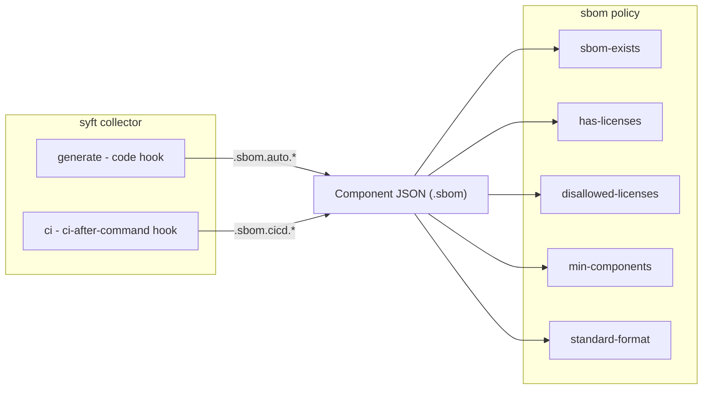

# SBOM Plugin Implementation Plan

## Current State

Both `pantalasa` and `pantalasa-cronos` have local prototypes:

- **Collector** (`collectors/sbom/`): Auto-generates CycloneDX SBOMs using Syft via a `code` hook. Writes to `.sbom.cyclonedx`. Has `install.sh` for Syft binary and Python license detection helpers.
- **Policy** (`policies/sbom/`): Two checks -- `sbom-exists` (asserts `.sbom`) and `sbom-disallowed-licenses` (regex match against component licenses).

**What's missing:** No CI detection sub-collector to detect when teams already run SBOM generation in their pipelines.

---

## Architecture

The collector is named `syft` (after the technology) and the policy is named `sbom` (after the concept), following the same pattern as `semgrep`/`sast` and `codecov`/`coverage`.



The two sub-collectors write to **separate paths** under `.sbom` to avoid conflicts:

- `.sbom.auto.*` -- auto-generated SBOM (generate sub-collector)
- `.sbom.cicd.*` -- CI-detected SBOM (ci sub-collector)

This is a temporary design: ideally the `generate` sub-collector would be skipped if the `ci` sub-collector already fired, but that conditional execution feature does not exist yet. Separate paths ensure both can run without overwriting each other, and the policy checks both.

---

## Collector: `syft`

Directory: `lunar-lib/collectors/syft/`

### Sub-collector 1: `generate` (code hook)

Based on the existing [pantalasa prototype](pantalasa/lunar/collectors/sbom/main.sh). Runs Syft automatically on every code push.

- **Hook:** `code`
- **Strategy:** Strategy 5 (Auto-Running Scanners)
- **Writes to `.sbom.auto.*`:**
    - `.sbom.auto.source.tool` = `"syft"`, `.sbom.auto.source.integration` = `"code"`, `.sbom.auto.source.version`
    - `.sbom.auto.cyclonedx` (full CycloneDX JSON)
- **install.sh:** Installs Syft binary + Python (for license detection)
- **default_image:** `earthly/lunar-lib:base-main` (or custom image if extra deps needed)

Key logic from existing prototype:

- Enables remote license lookups (Go, Java, Node, Python)
- Python projects: installs deps to temp dir for license metadata
- Skips empty SBOMs (no components)

### Sub-collector 2: `ci` (ci-after-command hook)

**New.** Detects when Syft runs in the CI pipeline (Strategy 1).

- **Hook:** `ci-after-command`
- **Pattern:** `.*\bsyft\b.*`
- **default_image_ci_collectors:** `native`
- **Writes to `.sbom.cicd.*`:**
    - `.sbom.cicd.source.tool` = `"syft"`, `.sbom.cicd.source.integration` = `"ci"`, `.sbom.cicd.source.version`
    - `.ci.artifacts.sbom_generated` = `true`
    - If an SBOM output file is detected (by parsing flags like `-o`/`--output`), collect it to `.sbom.cicd.cyclonedx` or `.sbom.cicd.spdx`

The CI sub-collector should parse `$LUNAR_CI_COMMAND` to:

1. Detect the output format (cyclonedx-json, spdx-json, etc.)
2. Find the output file path
3. If the SBOM file exists, collect it under `.sbom.cicd.cyclonedx` (or `.sbom.cicd.spdx`)

### Files

| File | Purpose |

|------|---------|

| `lunar-collector.yml` | Manifest with both sub-collectors, landing page, inputs |

| `generate.sh` | Auto-generate SBOM (from existing `main.sh`) |

| `ci.sh` | Detect Syft in CI pipeline |

| `install.sh` | Install Syft + Python (for generate sub-collector) |

| `helpers.sh` | Shared functions (SBOM format detection, license env setup) |

| `README.md` | Documentation |

| `assets/syft.svg` | Icon |

### `lunar-collector.yml` sketch

```yaml
version: 0

name: syft
description: Generate or detect CycloneDX/SPDX SBOMs using Anchore Syft
author: support@earthly.dev

default_image: earthly/lunar-lib:base-main
default_image_ci_collectors: native

landing_page:
  display_name: "Syft SBOM Collector"
  long_description: |
    Generate Software Bill of Materials automatically or detect existing
    Syft SBOM generation in CI pipelines. Supports CycloneDX and SPDX formats
    with license detection for Go, Java, Node.js, and Python.
  categories: ["security-and-compliance"]
  icon: "assets/syft.svg"
  status: "stable"
  related:
    - slug: "sbom"
      type: "policy"
      reason: "Enforces SBOM existence and license compliance"

collectors:
  - name: generate
    description: |
      Auto-generates a CycloneDX SBOM using Syft. Enables remote license
      lookups for Go, Java, Node.js, and Python. Writes full SBOM to
      .sbom.auto.cyclonedx with source metadata.
    mainBash: generate.sh
    hook:
      type: code

  - name: ci
    description: |
      Detects Syft execution in CI pipelines. Records source metadata to
      .sbom.cicd and optionally collects the generated SBOM file if the
      output path can be determined from command flags.
    mainBash: ci.sh
    hook:
      type: ci-after-command
      pattern: .*\bsyft\b.*

example_component_json: |
  {
    "sbom": {
      "auto": {
        "source": { "tool": "syft", "integration": "code", "version": "1.19.0" },
        "cyclonedx": {
          "bomFormat": "CycloneDX",
          "specVersion": "1.5",
          "components": [
            {
              "name": "github.com/sirupsen/logrus",
              "version": "v1.9.3",
              "licenses": [{ "license": { "id": "MIT" } }]
            }
          ]
        }
      },
      "cicd": {
        "source": { "tool": "syft", "integration": "ci", "version": "1.19.0" },
        "cyclonedx": { "...same structure..." }
      }
    }
  }
```

---

## Policy: `sbom`

Directory: `lunar-lib/policies/sbom/`

All checks look at both `.sbom.auto` and `.sbom.cicd` and operate on whichever has data. A helper function collects the components list from whichever path(s) exist.

### Check 1: `sbom-exists`

Asserts that an SBOM exists from either source. Checks `.sbom.auto` OR `.sbom.cicd`.

```python
from lunar_policy import Check

with Check("sbom-exists", "Checks that an SBOM was generated") as c:
    auto = c.get_node(".sbom.auto")
    cicd = c.get_node(".sbom.cicd")
    c.assert_true(
        auto.exists() or cicd.exists(),
        "No SBOM found. Enable the syft collector or run syft in your CI pipeline."
    )
```

### Check 2: `has-licenses`

Verifies that SBOM components have license information populated. Without this, `disallowed-licenses` silently passes on components with no license data.

- Input: `min_license_coverage` (percentage of components that must have license info, default `"90"`)
- Iterates components from `.sbom.auto.cyclonedx.components` and/or `.sbom.cicd.cyclonedx.components`
- Counts components with vs without `.licenses` entries
- Fails if the percentage of components with licenses is below the threshold
- Skips if no SBOM data exists

### Check 3: `disallowed-licenses`

Checks SBOM components for disallowed license patterns. Based on existing prototype at [pantalasa/lunar/policies/sbom/licenses.py](pantalasa/lunar/policies/sbom/licenses.py).

- Input: `disallowed_licenses` (comma-separated regex patterns, e.g. `"GPL.*,BSL.*,AGPL.*"`)
- Checks components from both `.sbom.auto.cyclonedx.components` and `.sbom.cicd.cyclonedx.components`
- For each, checks `.licenses[].license.id` against patterns
- Reports each violating component by name and license
- Skips if no SBOM data exists

### Check 4: `min-components`

Verifies the SBOM is not trivially empty. A generated SBOM with zero or very few components may indicate syft failed to detect the package manager.

- Input: `min_components` (minimum number of components required, default `"1"`)
- Counts total components across `.sbom.auto.cyclonedx.components` and/or `.sbom.cicd.cyclonedx.components`
- Fails if the total is below the threshold
- Skips if no SBOM data exists

### Check 5: `standard-format`

Validates the SBOM uses an approved format.

- Input: `allowed_formats` (comma-separated list, e.g. `"cyclonedx,spdx"`, default `""` which means any format is accepted)
- Detects format from the SBOM data (`.cyclonedx.bomFormat` or `.spdx.spdxVersion`)
- If `allowed_formats` is empty, the check auto-passes
- If set, fails if the detected format is not in the allowed list
- Skips if no SBOM data exists

### Files

| File | Purpose |

|------|---------|

| `lunar-policy.yml` | Manifest with all 5 checks, inputs, landing page |

| `sbom-exists.py` | Existence check |

| `has-licenses.py` | License coverage check |

| `disallowed-licenses.py` | License compliance check |

| `min-components.py` | Component count check |

| `standard-format.py` | Format validation check |

| `helpers.py` | Shared logic for collecting components from both paths |

| `requirements.txt` | `lunar_policy==0.2.2` |

| `test_policy.py` | Unit tests |

| `README.md` | Documentation |

| `assets/sbom.svg` | Icon |

### `lunar-policy.yml` sketch

```yaml
version: 0

name: sbom
description: Enforces SBOM existence, license compliance, completeness, and format
author: support@earthly.dev

default_image: earthly/lunar-lib:base-main

landing_page:
  display_name: "SBOM Policy"
  long_description: |
    Enforce Software Bill of Materials standards across your organization.
    Verify SBOMs are generated, contain license data, use approved formats,
    and do not include disallowed licenses.
  categories: ["security-and-compliance"]
  icon: "assets/sbom.svg"
  status: "stable"
  requires:
    - slug: "syft"
      type: "collector"
      reason: "Provides SBOM data for policy evaluation"

policies:
  - name: sbom-exists
    description: Checks that an SBOM was generated (auto or CI-detected).
    mainPython: ./sbom-exists.py
    keywords: ["sbom", "software bill of materials", "compliance"]
  - name: has-licenses
    description: Verifies SBOM components have license information populated.
    mainPython: ./has-licenses.py
    keywords: ["sbom", "licenses", "license coverage"]
  - name: disallowed-licenses
    description: Checks for disallowed licenses in SBOM components.
    mainPython: ./disallowed-licenses.py
    keywords: ["sbom", "licenses", "compliance", "gpl", "copyleft"]
  - name: min-components
    description: Verifies the SBOM contains a minimum number of components.
    mainPython: ./min-components.py
    keywords: ["sbom", "completeness", "components"]
  - name: standard-format
    description: Validates the SBOM uses an approved format (CycloneDX, SPDX).
    mainPython: ./standard-format.py
    keywords: ["sbom", "cyclonedx", "spdx", "format"]

inputs:
  disallowed_licenses:
    description: Comma-separated regex patterns of disallowed licenses (e.g. "GPL.*,AGPL.*")
  min_license_coverage:
    description: Minimum percentage of components that must have license info (0-100)
    default: "90"
  min_components:
    description: Minimum number of components the SBOM must contain
    default: "1"
  allowed_formats:
    description: Comma-separated list of allowed SBOM formats (e.g. "cyclonedx,spdx"). Empty means any.
    default: ""
```

---

## Component JSON Schema

The two sub-collectors write to **separate paths** under `.sbom`:

| Path | Type | Written By | Description |

|------|------|-----------|-------------|

| `.sbom.auto.source.tool` | string | generate | `"syft"` |

| `.sbom.auto.source.integration` | string | generate | `"code"` |

| `.sbom.auto.source.version` | string | generate | Syft version |

| `.sbom.auto.cyclonedx` | object | generate | Full CycloneDX JSON |

| `.sbom.auto.cyclonedx.components[]` | array | generate | SBOM components with licenses |

| `.sbom.cicd.source.tool` | string | ci | `"syft"` |

| `.sbom.cicd.source.integration` | string | ci | `"ci"` |

| `.sbom.cicd.source.version` | string | ci | Syft version |

| `.sbom.cicd.cyclonedx` | object | ci | Full CycloneDX JSON (if output file found) |

| `.ci.artifacts.sbom_generated` | boolean | ci | `true` |

**Future improvement:** When conditional collector execution is supported, the `generate` sub-collector should be skipped if `.sbom.cicd` already exists, and both can write to a single `.sbom.cyclonedx` path instead.

---

## Implementation Steps

1. Create worktree `lunar-lib-wt-syft` on branch `brandon/syft-sbom`
2. Implement the `syft` collector (port `generate.sh` from pantalasa, write new `ci.sh`)
3. Implement the `sbom` policy (all 5 checks + shared helpers)
4. Test using `lunar dev` commands against pantalasa-cronos components (see Testing section)
5. Complete the pre-push checklist (see LUNAR-PLUGIN-GUIDE.md)
6. Create draft PR

---

## Testing

### Local Dev Testing (relative paths)

Use relative paths in `pantalasa-cronos/lunar/lunar-config.yml` for fast iteration:

```yaml
collectors:
  - uses: ../lunar-lib-wt-syft/collectors/syft
    on: ["domain:engineering"]

policies:
  - uses: ../lunar-lib-wt-syft/policies/sbom
    name: sbom
    initiative: security
    enforcement: block-pr
    with:
      disallowed_licenses: "GPL.*,BSL.*,AGPL.*"
      min_license_coverage: "90"
      min_components: "1"
```

Run dev commands from `pantalasa-cronos/lunar`:

```bash
# Collector (run on multiple components)
lunar collector dev syft.generate --component github.com/pantalasa-cronos/backend
lunar collector dev syft.generate --component github.com/pantalasa-cronos/frontend
lunar collector dev syft.generate --component github.com/pantalasa-cronos/auth

# Policy (run on multiple components)
for component in backend frontend auth; do
  echo "=== $component ==="
  lunar policy dev sbom.sbom-exists --component github.com/pantalasa-cronos/$component
  lunar policy dev sbom.has-licenses --component github.com/pantalasa-cronos/$component
  lunar policy dev sbom.disallowed-licenses --component github.com/pantalasa-cronos/$component
  lunar policy dev sbom.min-components --component github.com/pantalasa-cronos/$component
  lunar policy dev sbom.standard-format --component github.com/pantalasa-cronos/$component
done
```

### Demo Environment Testing (branch references)

If you need to push to the demo hub, use branch references (requires pushing the branch first):

```yaml
collectors:
  - uses: github://earthly/lunar-lib/collectors/syft@brandon/syft-sbom
    on: ["domain:engineering"]
```

### Expected Results (pantalasa-cronos)

| Component | sbom-exists | has-licenses | disallowed-licenses | min-components | standard-format |
|-----------|-------------|--------------|---------------------|----------------|-----------------|
| backend (Go) | PASS | PASS (Go has good license metadata) | PASS (MIT/BSD typical) | PASS | PASS (CycloneDX) |
| frontend (Node) | PASS | PASS (npm packages have licenses) | FAIL if ISC matches `GPL.*` pattern? Verify | PASS | PASS (CycloneDX) |
| auth (Python) | PASS (if deps installed) or SKIP (if no deps detected) | May have lower coverage (Python license detection is weaker) | PASS | PASS | PASS (CycloneDX) |
| hadoop (Java) | PASS | PASS (Maven has good license metadata) | Verify no GPL deps | PASS | PASS (CycloneDX) |

*Note: These are draft expected results. The user will verify and adjust before handing off to the implementing agent.*

### Edge Cases to Test

1. **Component with no dependencies** -- Syft may produce an empty SBOM (0 components). The `generate` sub-collector should skip collection. `sbom-exists` should FAIL/SKIP, `min-components` should FAIL.
2. **Component where license detection is incomplete** -- Python projects without installed packages may have many components with no license info. `has-licenses` should report the coverage percentage and fail if below threshold.
3. **Empty `allowed_formats` input** -- `standard-format` should auto-pass (any format accepted). Verify it doesn't error on empty string.